## Breve Contexto del Estado de Hidalgo

Hidalgo presenta contrastes marcados entre zonas urbanas (como Pachuca, Mineral de la Reforma, Tula, Tulancingo) y regiones rurales o serranas (Sierra Alta, Huasteca, Valle del Mezquital). Estas últimas suelen tener:

-   Menor densidad de unidades médicas y personal de salud.

-   Mayores distancias para acceder a hospitales de segundo y tercer nivel.

-   Niveles más altos de marginación y carencia de servicios básicos.

Las tablas de vida muestran que, incluso antes de la pandemia (2010 y 2019), las probabilidades de muerte $q_x$ en edades adultas y adultas mayores son significativas. Esto es consistente con un perfil epidemiológico donde predominan las enfermedades del corazón, la diabetes mellitus y los tumores malignos como principales causas de defunción. En particular, las tasas de mortalidad $m_x$ para hombres y mujeres se elevan de manera sostenida a partir de los 45-50 años.

Por la pandemia de Covid-19, la tabla de vida de 2021 muestra una ruptura en la tendencia de mejora de la esperanza de vida observada entre 2010 y 2019. Para los hombres, la esperanza de vida al nacer en 2021 cae a 69.44 años (frente a 74.33 en 2010), mientras que para las mujeres desciende a 76.9 años (frente a 79.4 en 2010).

En este sentido, el crecimiento poblacional moderado (15.7% entre 2010 y 2020) y el envejecimiento de la estructura por edad indican que Hidalgo se encuentra en una fase avanzada de la transición demográfica: bajas tasas de natalidad y de mortalidad general, pero con un peso creciente de las enfermedades no transmisibles y de la mortalidad en edades avanzadas.

## **Diagrama de Flujo**

La siguiente figura resumen el proceso seguido para la construcción de las tablas de vida (elaborado en Canva):

```{r}
#| echo: false
#| out.width: "50%"
#| fig.align: "center"

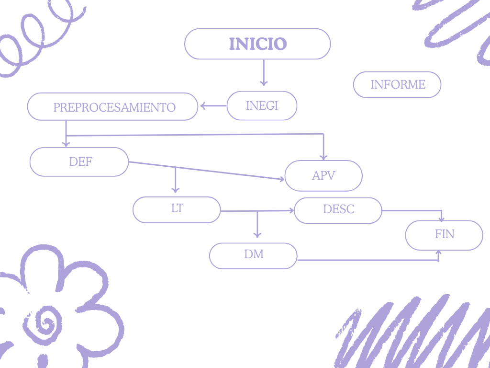
```

## **Fórmulas Utilizadas**

**1. Crecimiento exponencial**

Tasa de crecimiento continuo por edad

$$
r_x = \frac{\ln P_x(t_2) - \ln P_x(t_1)}{t_2 - t_1}
$$

Proyección poblacional

$$
\hat{P}_x(t) = P_x(t_1)e^{r_x(t-t_1)}
$$

**2. Tasa de mortalidad específica por edad**

$$
{}_n m_x = \frac{{}_n D_x}{{}_n N_x}
$$

**3. Estructura de la tabla de vida**

Para el promedio de años-persona vividos por aquellos que murieron entre las edades x y x+n, se utilizaron las ecuaciones de Coale y Demeny mostradas enseguida. Para los grupos de edades de 5-9 en adelante, en general se utiliza 2.5

$$
\begin{array}{|c|c|c|}\hline & \textbf{Hombres} & \textbf{Mujeres} \\\hline\begin{array}{c}\text{Valor de }a_0 \\\text{Si } {}_1m_0 \geq 0{,}107 \\\text{Si } {}_1m_0 < 0{,}107\end{array}&\begin{array}{c}0{,}330 \\0{,}045 + 2{,}684 \cdot {}_1m_0\end{array}&\begin{array}{c}0{,}350 \\0{,}053 + 2{,}800 \cdot {}_1m_0\end{array}\\\hline\begin{array}{c}\text{Valor de } {}_4a_1 \\\text{Si } {}_1m_0 \geq 0{,}107 \\\text{Si } {}_1m_0 < 0{,}107\end{array}&\begin{array}{c}1{,}352 \\1{,}651 - 2{,}816 \cdot {}_1m_0\end{array}&\begin{array}{c}1{,}361 \\1{,}522 - 1{,}518 \cdot {}_1m_0\end{array}\\\hline\end{array}
$$

Probabilidad de muerte

$$
{}_n q_x = \frac{n \times {}_n m_x}{1 + \left(n - {}_n a_x\right) {}_n m_x}
$$

Probabilidad de sobrevivir

$$
{}_n p_x = 1-{}_n q_x
$$

Escogemos un radix de 100,000

Defunciones

$$
{}_n d_x = l_x {}_nq_x \\
{}_n d_x  = l_x -l_{x+n}
$$

Número de años-persona vividos en el intervalo x y x+n

$$
{}_n L_x =nl_{x+n}+{}_n a_x {}_nd_x
$$

Número total de años-personas que les resta por vivir a los sobrevivientes de edad exacta x

$$
T_x = \sum_{a=x}^{\omega} {}_nL_a
$$

Esperanza de vida a la edad exacta x

$$
e_x^{0} = \frac{T_x}{l_x}
$$

## **Código usado para cada uno de los cálculos**

Como primer paso, se descargó la población de Hidalgo por sexo de acuerdo a los censos 2010 y 2020. Se hizo un prorrateo para distribuir la población no específicada. Con la población ya organizada por edades quinquenales, a excepción de los primeros 4 años (donde se hizo la separación de 0 a 1 año y de 1 a 4 años), procedimos a calcular las N con ayuda de las fórmulas de crecimiento exponencial.

Por otro lado, se descargó la base de datos de mortalidad de Hidalgo 1990 a 2024 por sexo y año de ocurrencia. Se hizo una tabla dinámica para poder filtrar los años que nos interesan (2010, 2019 y 2021). Así calculamos las D.

Todos los cálculos mencionados anteriormente se hicieron en un documento Excel: "Tablas de Mortalidad Hidalgo"

Después, se cargo este Excel a R studio para proceder a hacer los calculos.

```{r}
#---Librerías necesarias ---
library(readxl)
library(dplyr)
library(data.table)
library(lubridate)
library(ggplot2)

# --- Establecer ruta del archivo ---

ruta_archivo <- "C:/Users/samgr/OneDrive/Documentos/Trabajo final demografía/demografia_proyecto_hidalgo/Tablas de Mortalidad Hidalgo.xlsx"

# --- Lectura y limpieza de datos ---
hidalgo <- read_excel(ruta_archivo, 
                      sheet = "Tabla de Mortalidad F 2010"
                      #skip  = 3
                      ) %>%
  #Homologar los nombres de las columnas
  rename_with(~case_when(
    .x %in% c("x", "x(edad)") ~ "x",
    .x %in% c("n") ~ "n",
    .x %in% c("nNx", "N") ~ "N",
    .x %in% c("nDx", "D") ~ "D",
    TRUE ~ .x
  ))%>%
  
  #Transformar todas las columnas a variables numéricas
  
  mutate(
    x = as.numeric(x),
    n = as.numeric(n),
    N = as.numeric(N),
    D = as.numeric(D),
    #Cálculo de las tasas de mortalidad
    mx = D/N
  )

#--- Función de tablas de vida abreviadas ---
lt_abr <- function(x, n, mx, sex = "f", IMR = NA){
  m <- length(x)
  ax <- n/2
  #Ajustes Coale-Demeny para edades 0-1
  if(sex == "m"){
    ax[1] <- ifelse(mx[1]>=0.107, 0.330, 0.045+2.684*mx[1])
  }else{
    ax[1] <- ifelse(mx[1]>=0.107, 0.350, 0.053+2.800*mx[1])
  }
  
  #Ajustes Coales-Demeny para edades 1-4
  if(sex == "m"){
    ax[2] <- ifelse(mx[1]>=0.107, 1.352, 1.651+2.816*mx[1])
  }else{
    ax[2] <- ifelse(mx[1]>=0.107, 1.361, 1.522+1.518*mx[1])
  }
  
  
  #Probabilidad de muerte
  qx <- (n*mx)/(1+(n-ax)*mx)
  qx[m] <- 1
  
  #Probabilidad de sobrevivencia
  px <- 1 - qx
  
  # l_x
  lx <- 100000*cumprod(c(1, px[-m]))
  
  # dx
  dx <- c(-diff(lx), lx[m])
  
  #Lx
  Lx <- n*c(lx[-1],0)+ax*dx
  Lx[m] <- lx[m]/mx[m]
  
  #Tx
  Tx <- rev(cumsum(rev(Lx)))
  
  #e_x
  ex <- Tx/lx
  
  
  return(data.table(x, n, mx, ax, qx, px, lx, dx, Lx, Tx, ex))
}

#--- Aplicar función a tus datos ---
#Usamos las columnas ya limpias (x, n, mx) para calcular la tabla de vida
tabla_vidaf2010 <- lt_abr(x = hidalgo$x, n = hidalgo$n, mx = hidalgo$mx, sex = "f")

#---  Ver resultados ---
print(tabla_vidaf2010)

```

Este es el ejemplo para la tabla de vida para la población femenina de Hidalgo 2010. Así replicamos este código con cada tabla de vida, por sexo y año.

## **Cuadro con las esperanzas de vida al nacer por sexo y año**

```{r}
#| echo: false
#| out.width: "50%"
#| fig.align: "center"

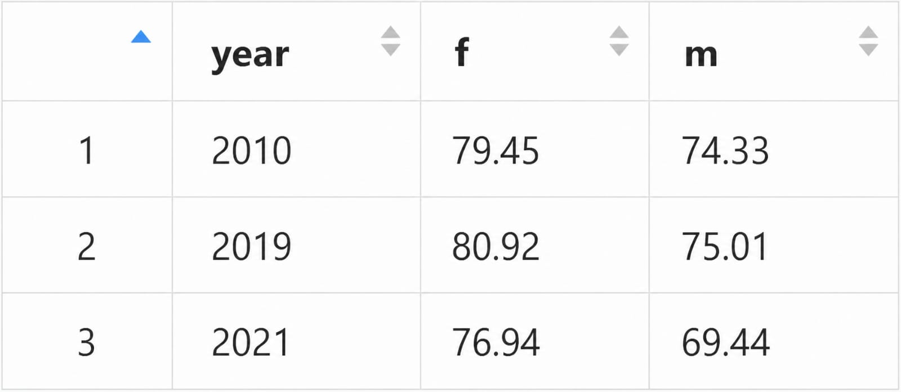
```

## **Gráficas**

```{r}
#| echo: false
#| out.width: "50%"
#| fig.align: "center"

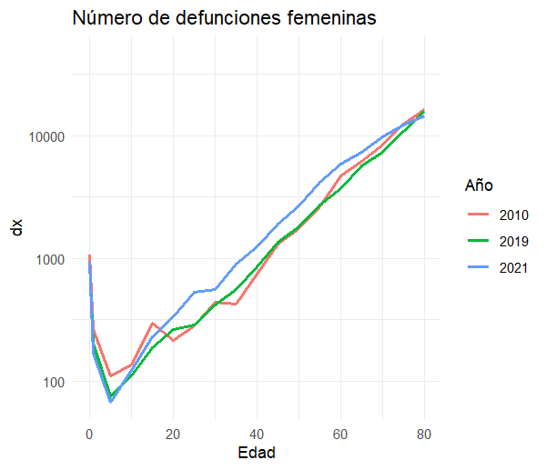
```

```{r}
#| echo: false
#| out.width: "50%"
#| fig.align: "center"

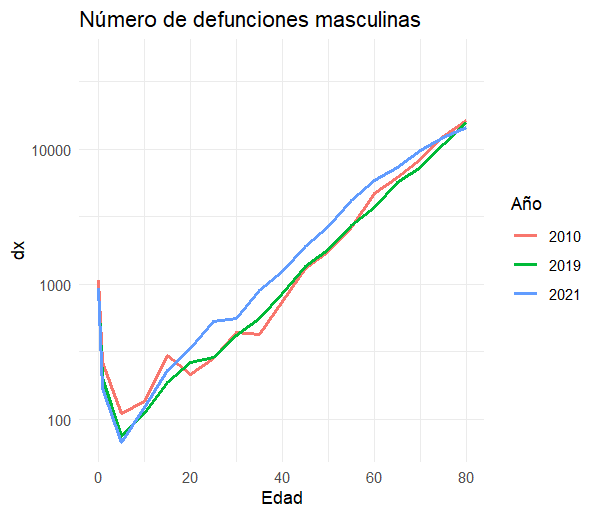
```

```{r}
#| echo: false
#| out.width: "50%"
#| fig.align: "center"

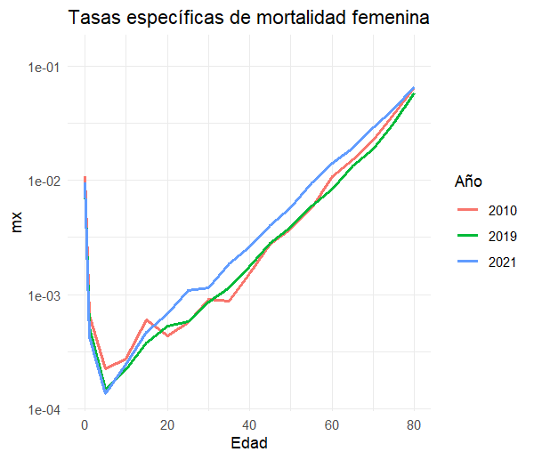
```

```{r}
#| echo: false
#| out.width: "50%"
#| fig.align: "center"

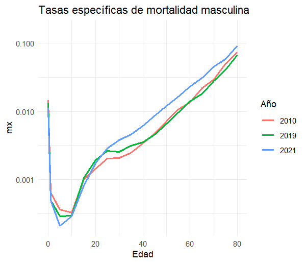
```

```{r}
#| echo: false
#| out.width: "50%"
#| fig.align: "center"

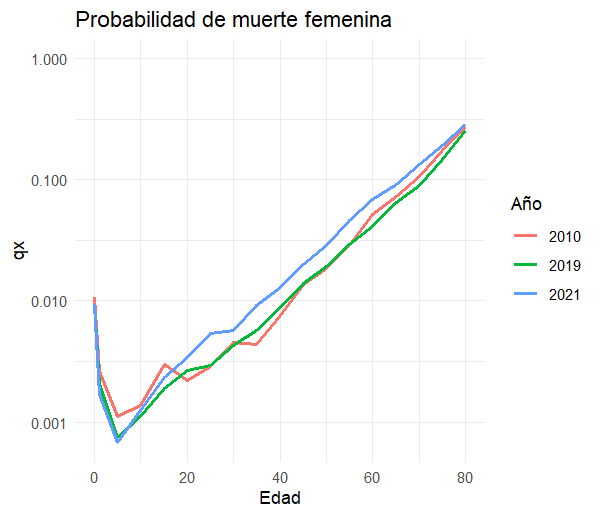
```

```{r}
#| echo: false
#| out.width: "50%"
#| fig.align: "center"

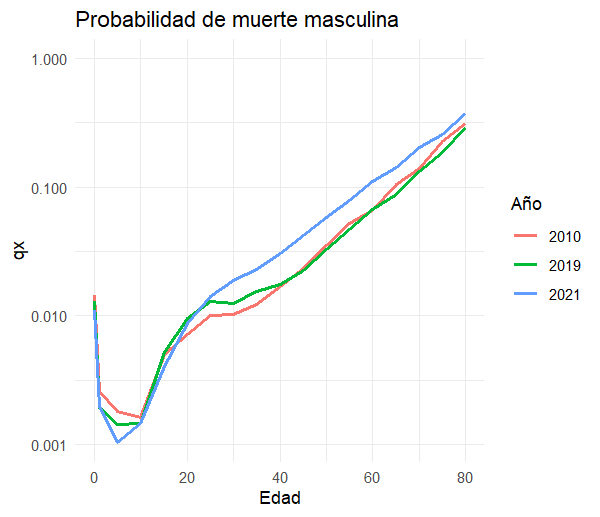
```

```{r}
#| echo: false
#| out.width: "50%"
#| fig.align: "center"

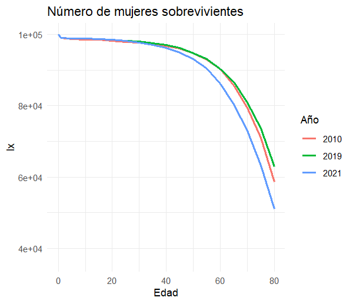
```

```{r}
#| echo: false
#| out.width: "50%"
#| fig.align: "center"

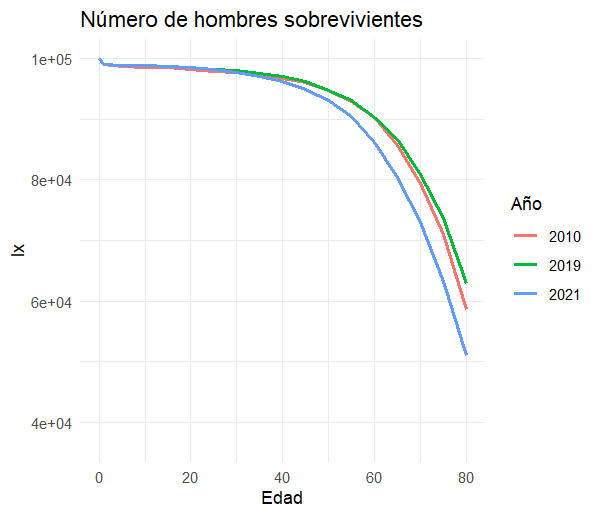
```

```{r}
#| echo: false
#| out.width: "50%"
#| fig.align: "center"

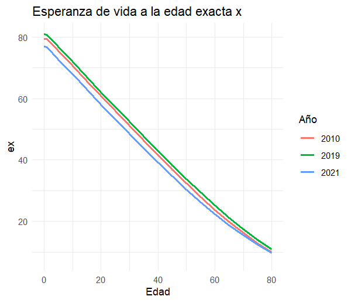
```

```{r}
#| echo: false
#| out.width: "50%"
#| fig.align: "center"

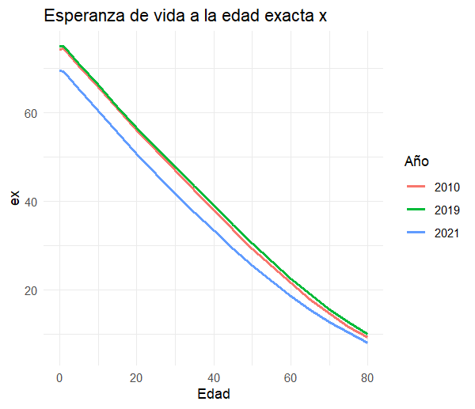
```

## **Tabla de mortalidad femenina Hidalgo 2010**

```{r}
#| echo: false
#| out.width: "50%"
#| fig.align: "center"

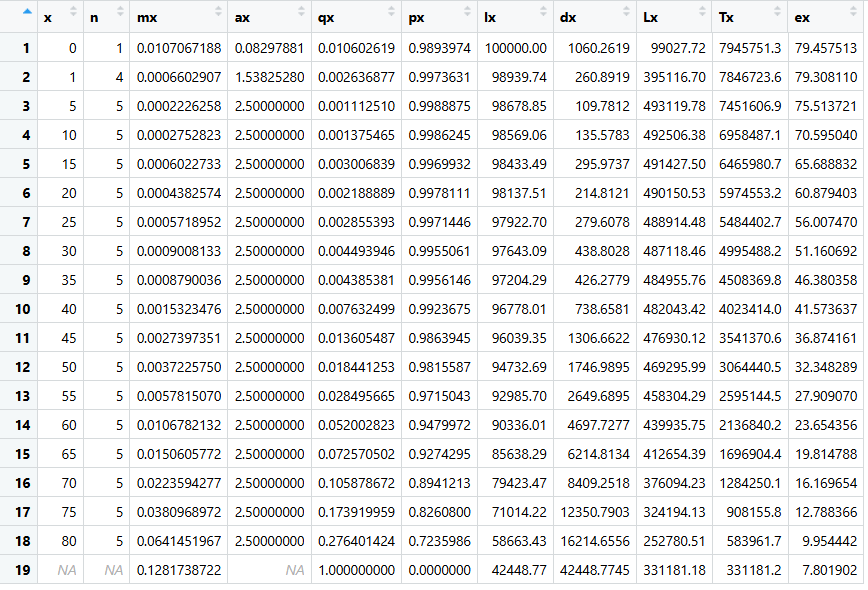
```

## **Tabla de mortalidad femenina Hidalgo 2019**

```{r}
#| echo: false
#| out.width: "50%"
#| fig.align: "center"

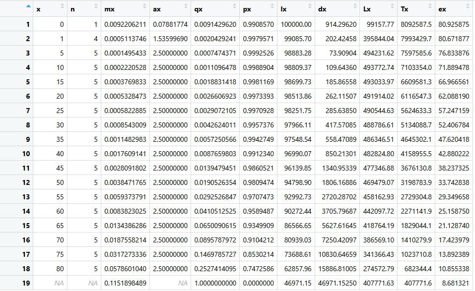
```

## **Tabla de mortalidad femenina Hidalgo 2021**

```{r}
#| echo: false
#| out.width: "50%"
#| fig.align: "center"

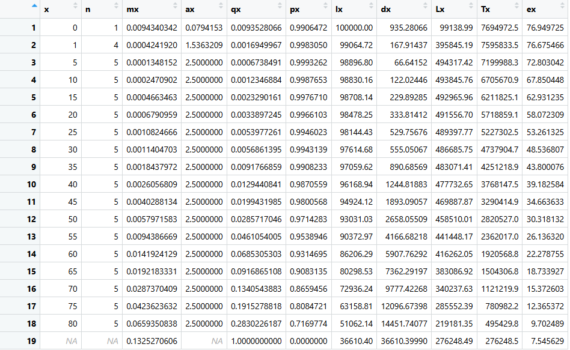
```

## **Tabla de mortalidad masculina Hidalgo 2010**

```{r}
#| echo: false
#| out.width: "50%"
#| fig.align: "center"

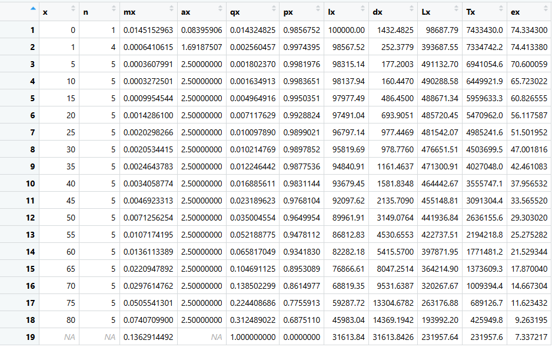
```

## **Tabla de mortalidad masculina Hidalgo 2019**

```{r}
#| echo: false
#| out.width: "50%"
#| fig.align: "center"

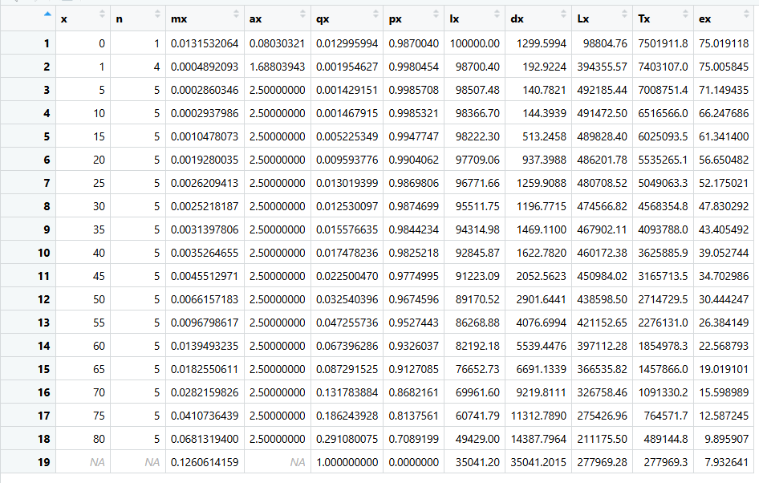
```

## **Tabla de mortalidad masculina Hidalgo 2021**

```{r}
#| echo: false
#| out.width: "50%"
#| fig.align: "center"

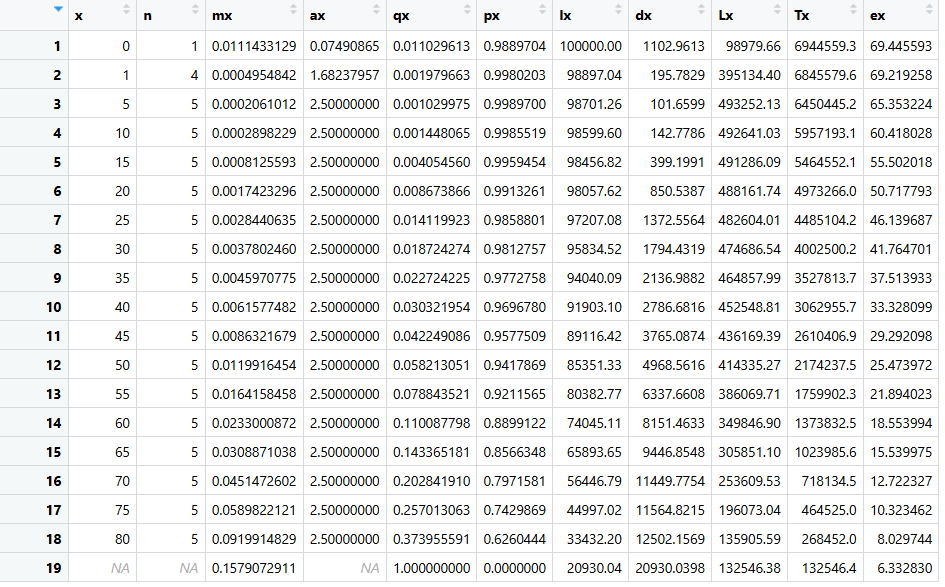
```

## **Resultados del analisis por indicadores y COVID**

## I. Supervivencia masculina

La supervivencia masculina presenta niveles inferiores a los de las mujeres en todos los años analizados. Entre 2010 y 2019 existía una mejora gradual; sin embargo, en 2021 se observa una disminución importante.

La caída de la curva de supervivencia masculina es más pronunciada que la femenina, lo que sugiere que los hombres fueron más afectados por la pandemia.

Este resultado coincide con estudios epidemiológicos internacionales que muestran una mayor vulnerabilidad masculina ante el COVID-19 debido a:

-   Mayor prevalencia de enfermedades crónicas.

-   Diferencias biológicas e inmunológicas.

-   Mayor exposición laboral y social.

-   Menor búsqueda oportuna de atención médica.

## II. Esperanza de vida masculina

La esperanza de vida masculina experimenta un deterioro notable en 2021.

En comparación con 2019, la reducción es más marcada que en mujeres, lo que evidencia que el impacto de la pandemia fue particularmente severo en la población masculina.

La caída de la esperanza de vida refleja un exceso de mortalidad concentrado principalmente en adultos y adultos mayores. Además, pone de manifiesto el retroceso temporal de los avances sanitarios acumulados durante la década previa

## III. Número de hombres sobrevivientes

El número de sobrevivientes masculinos disminuye más rápidamente conforme avanza la edad.

La curva de 2021 muestra un descenso mucho más acelerado respecto a 2010 y 2019, especialmente después de los 40 y 50 años.

Esto indica que:

-   El COVID-19 incrementó fuertemente la mortalidad masculina.

-   La pérdida de sobrevivientes fue más intensa en hombres adultos.

-   El efecto de la pandemia alteró significativamente la estructura de supervivencia.

El análisis comparativo permite concluir que:

-   Las mujeres mantienen mejores indicadores de supervivencia y esperanza de vida.

-   Los hombres presentan mayores tasas de mortalidad y probabilidad de muerte.

-   El impacto del COVID-19 fue más severo en hombres.

-   La reducción de la esperanza de vida masculina fue más intensa.

Estas diferencias son coherentes con los patrones demográficos y epidemiológicos observados a nivel nacional e internacional durante la pandemia.

Como conclusión, los resultados evidencian cómo una emergencia sanitaria puede alterar de manera rápida y profunda la dinámica demógrafica de una población.
